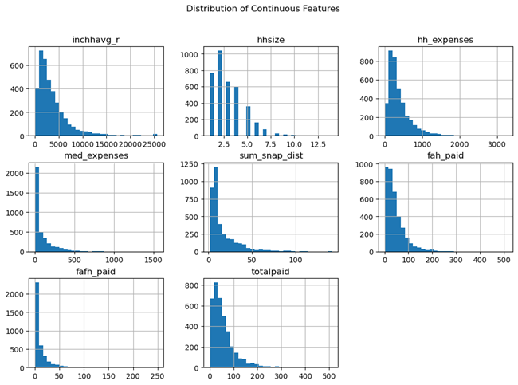

**SNAP PARTICIPATION AND MACHINE LEARNING PROJECT**

**(1) Project Overview and Purpose:**

This project aims to apply machine learning techniques to predict and analyze Simplified Nutritional Assistance Program (SNAP) participation trends. By leveraging historical data, socioeconomic indicators, and other relevant variables, machine learning models can identify patterns and forecast changes in participation rates with greater precision.

What is SNAP? SNAP, previously known as food stamps, is a federal aid program designed to provide nutritional support to low-income individuals and families in the United States. And SNAP participation is critical for understanding how well this program reaches eligible individuals and addresses food insecurity. Insights into participation rates help policymakers ensure that resources are efficiently allocated and accessible.

**(2) Dataset Description:**

The United States Department of Agriculture (USDA) conducts surveys on household on food purchases and behaviors. The results of these surveys includes nationally representative data from 4,826 households, including Supplemental Nutrition Assistance Program (SNAP) households, low-income households not participating in SNAP, and higher income households.

The dataset used in this project contains various features related to socio-economic, demographic, and policy-related factors that impact SNAP for different datasets retrieved from: https://www.ers.usda.gov/data-products/foodaps-national-household-food-acquisition-and-purchase-survey/

•	faps_access_puf.csv

•	faps_fafhevent_puf.csv 

•	faps_fahevent_puf.csv

•	faps_household_puf.csv

**(3) Data Cleaning and Preprocessing:**

A determination was made about collecting which variables to use from the retrieved datasets for this project by:

(a) Merging on hhnum (6-digit unique identifier for each household) for each dataset

(b) Reducing df to essential variables

(c) Dropping negative and missing values

(d) Generating clean snap_data .CSV file located in Data Folder with:

     (i)    hhnum: 6-digit unique identifier for each household
     
     (ii)   snapnowhh: Anyone in household is receiving SNAP benefits (Y/N)
     
     (iii)  inchhavg_r: Household average (monthly) income as sum of average imputed income per member (top-coded) 
     
     (iv)   hhsize: Number of people at residence, excluding guests
     
     (v)    hh_expenses: sum of household expenditures, averaged by household size
     
     (vi)   med_expenses: sum of medical costs (insurance, rx, etc), averaged by household size
     
     (vii)  sum_snap_dist: sum of distance to nearest SNAP-authorized establishment
     
     (viii) fah_paid: Total amount paid for food at home, including tax
     
     (ix)   fafh_paid: Total amount paid for food away from home, including tax (and tip when FAFH)
     
     (x)    totalpaid: Total amount paid for both FAH and FAFH, including tax (and tip when FAFH)

(e) The cleaned data was converted to a SQL database.

**(4) Data Visualization Techniques:**

(a) EXPLORATORY DATA ANALYSIS [EDA]:

     (i)    Plot histograms for continuous variables
            

     (ii)   Correlation matrix  - Plot heatmap

     (iii)  Boxplot for household income vs. SNAP participation

     (iv)   Pair plot

(b) MACHINE LEARNING MODELING

     (i)    Logistic Regression was likely chosen for the SNAP Participation project because it’s well-suited for binary classification problems, offers interpretability, is computationally efficient, and provides a solid baseline to compare more complex models.

     (ii)   Random Forest Analysis is a strong choice for this project because it can handle the complex, non-linear relationships that might exist between household characteristics (income, size, expenses, etc.) and SNAP participation. Additionally, its ability to 
            provide insights into feature importance can help identify key drivers of SNAP participation, which is valuable for policy decisions

     (iii)  Neural Network Testing was chosen for this project due to its ability to model complex, non-linear relationships, their scalability, and its potential for higher predictive accuracy. Additionally, the flexibility in architecture and automatic feature 
            interaction learning makes neural networks a powerful option for modeling SNAP participation, providing a solid foundation for future improvements.

            (1) FIRST ITERATION - 4 layers; neurons = 75; 37; 18, 1; activation = relu; and epochs = 100

            (2) SECOND ITERATION - 4 layers; neurons = 75; 37; 18, 1; activation = tanh; and epochs = 100

(c) TABLEAU - visualizing the project providing powerful insights into the data and trends

     (i)    Bar and line charts to visualize Count of household, avg. of Snap distance and avg. of income vs household size

     (ii)   Scatter plot of the distribution of FAFH Paid and FAH Paid

     (iii)  Gantt charts to visualize Avg. Income vs. Expenses

**(5) Results and Analysis:**

(a) EXPLORATORY DATA ANALYSIS [EDA]: 

The exploratory analysis highlights income, housing costs, and household size as the primary indicators of SNAP participation. Households with lower incomes and higher housing expenses are more likely to enroll in the program. While proximity to a SNAP-authorized store has a limited impact, it could still influence participation rates in specific regions, such as rural areas. Medical expenses, though not a strong overall predictor, may be more relevant for elderly or medically vulnerable households.

 
(b)  MACHINE LEARNING MODELING

     (i) Logistic Regression:

         
         Running model with all features: The model predicts with an average accuracy of 78% and struggles to accurately predict "Not Participating" instances.
         
         
         Running model by excluding two features [fah_paid and fafh_paid] to try and improve model performance: The model also predicts with an average accuracy of 78% and struggles to accurately predict "Not Participating" instances

         **CONCLUSION:** No improvement to model accuracy by removing features, namely fah_paid and fafh_paid

         
     (ii) Random Forest Analyst result with the breakdown of the key metrics of Testing Classification Report:

     
                                                   precision    recall  f1-score   support
                                                 
            Participating [labeled 1]       	          0.82         0.90      0.86       621
          
            Not Participating [labeled 0]      	     0.74         0.61      0.67       310

            accuracy                           				             0.80       931
          
            macro avg      			               0.78         0.75      0.76       931
          
            weighted avg     		                    0.80         0.80      0.79       931

           This report indicates that the model performs better in predicting "Participating" instances compared to "Not Participating," as shown by the higher precision and recall for the "Participating" class

 
     (iii)	Neural Network Testing:

            (1)  FIRST ITERATION - 4 layers; neurons = 75; 37; 18, 1; activation = relu; and epochs = 100
          
                 Results:
          
                -	Loss: 0.4754

                -	Accuracy: 0.7820 (or 78.20%)

                The loss value of 0.4754 suggests that the model still has some room for improvement in its predictions. A lower loss indicates a better fit of the model to the data.

                The accuracy of 78.20% is a fairly good starting point, but there is likely potential to increase it with further tuning of hyperparameters or adjusting the model architecture.

            (2) SECOND ITERATION - 4 layers; neurons = 75; 37; 18, 1; activation = tanh; and epochs = 100

                Results:
          
                -	Loss: 0.4430

                -	Accuracy: 0.8024 (80.24%)

          
          Comparison with First Iteration:

          - Loss: The loss decreased from 0.4754 to 0.4430, indicating that the model fit the data slightly better in this iteration.

          - Accuracy: The accuracy improved from 78.20% to 80.24%, a modest but notable improvement by switching to the tanh activation function.

          **CONCLUSION:** The tanh activation function seems to perform better in this case than ReLU. This may be because tanh outputs values between -1 and 1, which can help in dealing with negative input values, especially in the earlier layers of the network. It’s 
          particularly useful when the data is centered around zero.

**(6) Ethical Considerations:**

Accurately predicting and understanding SNAP participation rates can be difficult due to the complexity of social, economic, demographic factors involved and also the giving data of participants. For example, variations in eligibility, changes in employment rates, or policy adjustments can all influence participation levels. The information in the dataset is publicly available online and could be used to identify people and/or households. The data should be handled with care and sequestered while in analysis.

The opportunity for bias exists for datasets like these, impacting disproportionately lower income families or households. The modeling can help identify at risk households and can be used by governmental or political entities to exclude groups from participation in helpful programs like SNAP

**(7) Instructions for Interacting with the Project:**

(Provide clear instructions on how to interact with the visualizations, such as how to run the code or access the visualizations)

**(8) CITATIONS:**

Questions were asked of the Xpert Learning Assistant, such as code syntax questions, resolution of errors (troubleshooting), etc. 
